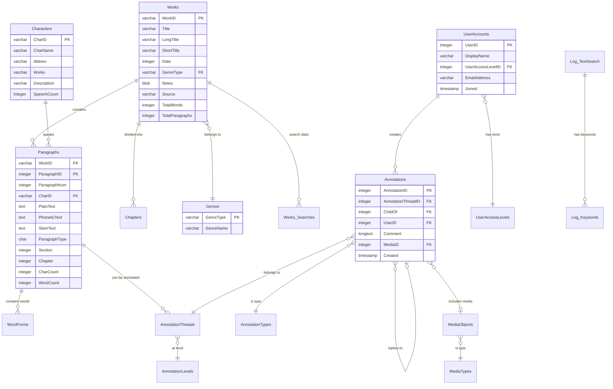

# Shakespeare Database (shake.db) Documentation

## Overview

The `shake.db` database is a comprehensive SQLite database containing the complete works of William Shakespeare. It includes all 43 plays, poems, and sonnets with detailed structural annotations, character information, and advanced search capabilities. The database is designed for literary analysis, text mining, and educational applications.

## Database Statistics

- **Works**: 43 complete works (plays, poems, sonnets)
- **Characters**: 1,265 unique characters across all works
- **Paragraphs**: 35,629 text segments
- **Genres**: 5 types (Comedy, History, Poem, Sonnet, Tragedy)

## Schema Overview

### Core Content Tables

#### Works
The primary table containing all Shakespeare works.
```sql
Works (
  WorkID varchar(50) PRIMARY KEY,     -- Unique identifier (e.g., 'hamlet', 'macbeth')
  Title varchar(255),                 -- Work title
  LongTitle varchar(255),             -- Extended title
  ShortTitle varchar(255),            -- Abbreviated title
  Date integer,                       -- Publication/composition date
  GenreType varchar(255),             -- Genre code (c/h/p/s/t)
  Notes blob,                         -- Additional notes
  Source varchar(255),                -- Source information
  TotalWords integer,                 -- Word count
  TotalParagraphs integer             -- Paragraph count
)
```

#### Paragraphs
Contains the actual text content, broken into manageable segments.
```sql
Paragraphs (
  WorkID varchar(255),                -- References Works.WorkID
  ParagraphID integer PRIMARY KEY,    -- Unique paragraph identifier
  ParagraphNum integer,               -- Sequential paragraph number
  CharID varchar(255),                -- Speaking character ID
  PlainText text,                     -- Raw text content
  PhoneticText text,                  -- Phonetic representation
  StemText text,                      -- Stemmed text for searching
  ParagraphType char(1),              -- Type indicator
  Section integer,                    -- Section number
  Chapter integer,                    -- Chapter/act number
  CharCount integer,                  -- Character count
  WordCount integer                   -- Word count
)
```

#### Characters
Information about all characters across Shakespeare's works.
```sql
Characters (
  CharID varchar(50) PRIMARY KEY,     -- Unique character identifier
  CharName varchar(255),              -- Character name
  Abbrev varchar(255),                -- Abbreviation
  Works varchar(255),                 -- Works where character appears
  Description varchar(255),           -- Character description
  SpeechCount integer                 -- Number of speeches
)
```

### Structure and Navigation

#### Chapters
Hierarchical structure for organizing works into acts, scenes, etc.
```sql
Chapters (
  WorkID varchar(255),                -- Work identifier
  ChapterID integer PRIMARY KEY,      -- Unique chapter ID
  Section integer,                    -- Section number
  Chapter integer,                    -- Chapter/act number
  Description varchar(255)            -- Chapter description
)
```

#### Genres
Classification system for Shakespeare's works.
```sql
Genres (
  GenreType varchar(255) PRIMARY KEY, -- Genre code
  GenreName varchar(255)              -- Genre name
)
```

### Search and Analysis

#### WordForms
Linguistic analysis data for text searching and analysis.
```sql
WordForms (
  WordFormID integer PRIMARY KEY,     -- Unique word form ID
  PlainText varchar(100),             -- Original word
  PhoneticText varchar(100),          -- Phonetic representation
  StemText varchar(100),              -- Word stem
  Occurences integer                  -- Frequency count
)
```

#### Log_TextSearch
Search activity logging for analytics.
```sql
Log_TextSearch (
  Log_TextSearchID integer PRIMARY KEY,
  UserAddress varchar(255),           -- User IP address
  Searchpage varchar(255),            -- Search page
  Timestamp integer,                  -- Search timestamp
  Searchtype varchar(255),            -- Type of search
  Keywords text,                      -- Search terms
  Works text,                         -- Works searched
  Characters text,                    -- Characters searched
  Genres varchar(255),                -- Genres searched
  -- Additional search parameters...
)
```

### User System

#### UserAccounts
User management for annotation and personalization features.
```sql
UserAccounts (
  UserID integer PRIMARY KEY,         -- Unique user ID
  DisplayName varchar(255),           -- Display name
  UserAccessLevelID integer,          -- Access level
  PersonalTitle varchar(255),         -- Title
  FirstName varchar(255),             -- First name
  MiddleName varchar(255),            -- Middle name
  LastName varchar(255),              -- Last name
  Institution varchar(255),           -- Institution
  Joined timestamp,                   -- Join date
  EmailAddress varchar(255),          -- Email
  Password varchar(16),               -- Password (encrypted)
  PasswordHint varchar(255)           -- Password hint
)
```

### Annotation System

#### Annotations
User-generated annotations and comments on text passages.
```sql
Annotations (
  AnnotationID integer PRIMARY KEY,   -- Unique annotation ID
  AnnotationThreadID integer,         -- Thread this belongs to
  ChildOf integer,                    -- Parent annotation (for replies)
  UserID integer,                     -- Annotating user
  Comment longtext,                   -- Annotation text
  ExternalLink_URL mediumtext,        -- External link
  MediaID integer,                    -- Associated media
  StartAt integer,                    -- Start position
  Created timestamp                   -- Creation timestamp
)
```

#### AnnotationThreads
Groups related annotations together.
```sql
AnnotationThreads (
  AnnotationThreadID integer PRIMARY KEY,
  Annotation_Level varchar(255),      -- Annotation scope level
  Annotation_Work varchar(255),       -- Target work
  Annotation_Chapter integer,         -- Target chapter
  Annotation_Section integer,         -- Target section
  Annotation_Paragraph integer,       -- Target paragraph
  Annotation_PassageBegin integer,    -- Start position
  Annotation_PassageLength integer,   -- Length of annotated passage
  AnnotationTypeID varchar(255),      -- Type of annotation
  Created timestamp                   -- Creation timestamp
)
```

### Media Support

#### MediaObjects
Multimedia content associated with works.
```sql
MediaObjects (
  MediaObjectID integer PRIMARY KEY,  -- Unique media ID
  Title varchar(255),                 -- Media title
  Description longtext,               -- Media description
  Length integer,                     -- Duration/size
  MediaTypeID varchar(255)            -- Media type
)
```

## Entity Relationship Diagram



## Genre Classification

| Code | Genre | Examples |
|------|-------|----------|
| c | Comedy | Twelfth Night, As You Like It, Comedy of Errors |
| h | History | Henry V, Richard III, King John |
| p | Poem | Venus and Adonis, The Rape of Lucrece |
| s | Sonnet | Sonnets 1-154 |
| t | Tragedy | Hamlet, Macbeth, Othello, King Lear |

## Common Query Examples

### Basic Text Search
```sql
-- Find all paragraphs containing "to be or not to be"
SELECT w.Title, p.PlainText, p.ParagraphNum
FROM Paragraphs p
JOIN Works w ON p.WorkID = w.WorkID
WHERE p.PlainText LIKE '%to be or not to be%';
```

### Character Analysis
```sql
-- Get all speaking parts for Hamlet
SELECT p.PlainText, p.ParagraphNum, w.Title
FROM Paragraphs p
JOIN Works w ON p.WorkID = w.WorkID
JOIN Characters c ON p.CharID = c.CharID
WHERE c.CharName = 'Hamlet'
ORDER BY p.ParagraphNum;
```

### Work Statistics
```sql
-- Get word count by genre
SELECT g.GenreName, SUM(w.TotalWords) as TotalWords, COUNT(*) as WorkCount
FROM Works w
JOIN Genres g ON w.GenreType = g.GenreType
GROUP BY g.GenreType, g.GenreName
ORDER BY TotalWords DESC;
```

### Character Appearances
```sql
-- Find characters that appear in multiple works
SELECT c.CharName, c.Works, c.SpeechCount
FROM Characters c
WHERE c.Works LIKE '%,%'
ORDER BY c.SpeechCount DESC;
```

### Annotation Queries
```sql
-- Get all annotations for a specific work
SELECT a.Comment, u.DisplayName, a.Created, at.AnnotationTypeID
FROM Annotations a
JOIN AnnotationThreads ath ON a.AnnotationThreadID = ath.AnnotationThreadID
JOIN UserAccounts u ON a.UserID = u.UserID
LEFT JOIN AnnotationTypes at ON ath.AnnotationTypeID = at.AnnotationTypeID
WHERE ath.Annotation_Work = 'hamlet'
ORDER BY a.Created DESC;
```

## Usage Patterns

### Text Analysis
- Use `PlainText` for exact searches
- Use `StemText` for linguistic analysis
- Use `PhoneticText` for sound-based searches
- Word frequency analysis via `WordForms` table

### Navigation
- `Works` → `Chapters` → `Paragraphs` provides hierarchical navigation
- `Section` and `Chapter` fields organize content by acts/scenes
- `ParagraphNum` provides sequential ordering

### User Interaction
- `UserAccounts` manages user profiles
- `Annotations` system supports collaborative analysis
- Search logging tracks usage patterns

### Performance Considerations
- Index on `WorkID`, `CharID` for fast joins
- `PlainText` column suitable for full-text search
- Consider adding indexes on commonly searched fields

## Sample Works

| WorkID | Title | Genre | Year |
|--------|-------|-------|------|
| hamlet | Hamlet | Tragedy | 1600 |
| macbeth | Macbeth | Tragedy | 1606 |
| 12night | Twelfth Night | Comedy | 1601 |
| romeojuliet | Romeo and Juliet | Tragedy | 1595 |
| asyoulikeit | As You Like It | Comedy | 1599 |

This database provides a rich foundation for Shakespeare scholarship, text mining, educational applications, and literary analysis tools.